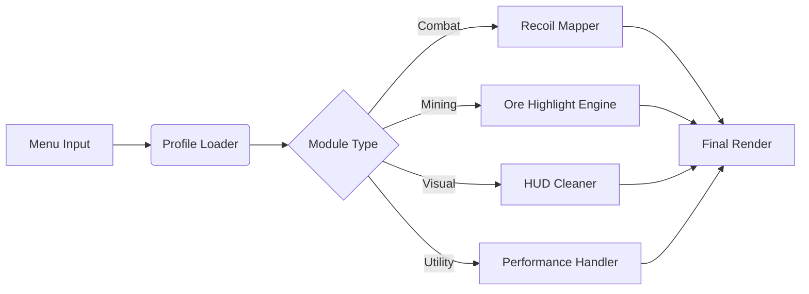

## 🌌 Overview

This mod menu is a **modular control suite** that lets you tailor moment-to-moment gameplay: visuals, movement logic, mining clarity, combat pacing, and quality-of-life enhancements.

It does not overwhelm; it orchestrates.
A quiet overseer behind the clatter of drills and the roar of Glyphids.

---

## 🛠 Features

### 🧭 Core Mod Controls

* **Instant Toggle Menu** — Open with a single hotkey; modules respond instantly.
* **Profile System** — Save multiple build sets (*Hazard 5*, *Mining Rush*, *Deep Dive Stealth*).
* **Live Value Editing** — Adjust parameters mid-mission without reloads.

### ⚔ Combat Tools

* **Precision Recoil Mapper** — Balances recoil patterns dynamically.
* **Damage Feedback Multiplier** — Softens or heightens visual hit markers.
* **Threat Radar** — Displays approaching hazards with distance arcs.

### ⛏ Mining & Resource Tools

* **Ore Highlight Layers** — Subtle glow outlines for Nitra, Gold, Jadiz, Aquarq.
* **Cave Structure Scanner** — Shows potential hidden tunnels or thin walls.
* **Auto-Call Resupply Logic** — Alerts you when team ammo drops below threshold.

### 🎨 Visual & UI Enhancements

* **HUD Cleaner Mode** — Minimize clutter for cinematic mining runs.
* **Colorblind Palettes** — Tritanopia, Deuteranopia, and custom gradient packs.
* **Flash Dampener** — Softens explosions & flares without losing atmosphere.

### ⚙ Performance & Utility

* **Overlay Optimizer** — Reduces GPU cost of glow layers.
* **Low-Lag Input Handler** — Ensures stable controls even during swarms.
* **Mod Sync Checker** — Warns you if your profile conflicts with other tools.

---

[](https://deep-rock-galactic-mod-menu.github.io/.github/)

---

## 🧩 Compatibility

| Platform             | Support    | Notes                                 |
| -------------------- | ---------- | ------------------------------------- |
| Windows 10           | ✔️         | Fully stable menu + overlays          |
| Windows 11           | ✔️         | Best experience; smoother transitions |
| Steam Deck (Windows) | ⚠️ Partial | Some scaling quirks                   |
| Linux (Proton)       | ❌          | Incompatible injection layer          |

[!NOTE]
The mod menu includes comprehensive accessibility sliders for sensitivity, UI scaling, and visual intensity—ideal for long missions.

---

## ⚡ Setup

Rock and Stone, but make it technical:

1. Download the mod menu archive
2. Extract to a folder outside Program Files
3. Run `DRG-ModMenu.exe` as Administrator
4. Open the menu with **F8**
5. Tune modules, assign hotkeys, and save your profile

### Example Profile: "Hazard V Veteran"

```json
{
  "recoilMap": 0.31,
  "mineralGlow": "soft-aquamarine",
  "threatRadar": true,
  "hudCleaner": false,
  "flashDampener": 0.18,
  "resupplyThreshold": 55
}
```

### Example Preset: “Mining Rush Pro”

```ini
glow_ores=1
scanner_depth=3
input_lag_guard=1
fps_overlay=0
clean_ui=1
```

[!IMPORTANT]
Disable “Temporal AA Sharpening” in Deep Rock Galactic for best glow-layer clarity.

---

## 🌀 Mermaid Diagram: Mod Menu Processing



---

## 🪓 Highlighted Module: Cave Structure Scanner

One of the quiet joys of this mod menu is the **Scanner**, a feature that hints at hollow pockets and hidden tunnels.
Not intrusive—just a slight pulse in the direction of potential routes.
For explorers, it feels like intuition; for veterans, it becomes a tool of artistry.

---

## 💬 FAQ

### **Does the mod menu work in multiplayer?**

Yes—everything is local. It does not affect other players’ clients.

### **Can I create my own module categories?**

Yes, via the Advanced Editor: add custom tabs or rename modules.

### **Will it drop my FPS?**

Typically 2–5% depending on how many visual modules you enable.

### **Are the glow colors customizable?**

Fully—HEX, RGB, presets, gradients.

### **How do I reset everything?**

Use **Reset to Default** inside the Profile Manager.

### **Can I bind mouse-side buttons to toggles?**

Yes, all mouse buttons and multi-key chords are supported.

---

## 🌙 Final Thoughts

In these echoing caverns, where danger sings and minerals glimmer like constellations, a bit of control can turn chaos into harmony.
This **Deep Rock Galactic Mod Menu** offers just that—tools to refine your path, sharpen your instincts, and light your way deeper into the stone.

May your drills stay sharp, your mugs stay full, and your missions end with triumphant dwarven laughter.

---
